# Saile Platform v2 — Project Architecture & Status Flow

```mermaid
flowchart TD
    %% Styling
    classDef working fill:#d4edda,stroke:#28a745,stroke-width:2px,color:#155724
    classDef partial fill:#fff3cd,stroke:#ffc107,stroke-width:2px,color:#856404
    classDef broken fill:#f8d7da,stroke:#dc3545,stroke-width:2px,color:#721c24
    classDef security fill:#f0f8ff,stroke:#17a2b8,stroke-width:2px,color:#0c5460
    classDef infra fill:#e7f3ff,stroke:#007bff,stroke-width:2px,color:#004085
    
    %% ============================
    %% USER & ACCESS LAYER
    %% ============================
    subgraph USER["User Roles"]
        direction TB
        Admin([Admin]):::infra
        Manager([Branch Manager]):::infra
        Officer([Field Officer]):::infra
        Accountant([Accountant]):::infra
        Auditor([Auditor]):::infra
    end
    
    subgraph AUTH["Authentication & Session"]
        direction TB
        Login[Login System]:::working
        Session[Session Mgmt / 15min]:::working
        Guard[RBAC Route Guards]:::working
        Timeout[Activity Timeout]:::working
    end
    
    %% ============================
    %% ROUTING & NAVIGATION
    %% ============================
    subgraph ROUTER["SPA Router"]
        direction TB
        HashRoute[Hash-based Routing]:::working
        NavFilter[Dynamic Navigation]:::working
        RouteGuard[Permission Checks]:::working
    end
    
    %% ============================
    %% CORE MODULES (ALL WORKING)
    %% ============================
    subgraph MODULES["Business Modules - ALL WORKING ✅"]
        direction TB
        Dash([Dashboard]):::working
        Clients([Client Registry]):::working
        Groups([Groups Management]):::working
        Loans([Loan Products]):::working
        Repay([Repayment]):::working
        Coll([Collections]):::working
        Follow([Follow-up]):::working
        Save([Savings Module]):::working
        Acct([Accounting]):::working
        Audit([Audit Trail]):::working
        Sync([Sync Module]):::working
        Users([Users Mgmt]):::working
        Settings([System Settings]):::working
    end
    
    %% ============================
    %% FINANCIAL ALGORITHMS
    %% ============================
    subgraph ALGO["Financial Algorithms - WORKING ✅"]
        direction TB
        Amort([Amortization Schedule<br/>Flat & Declining]):::working
        PAR([Portfolio at Risk<br/>PAR 1-30/31-90/90+]):::working
        Eff([Collection Efficiency]):::working
        Trial([Trial Balance]):::working
        Calc([Due Date Calculator]):::working
    end
    
    %% ============================
    %% DATA LAYER
    %% ============================
    subgraph DATA["Data Layer"]
        direction TB
        Storage[(localStorage<br/>13 Data Stores)]:::working
        UUID[UUID Generator]:::working
        CRUD[CRUD Operations]:::working
        Esc[XSS Escaping]:::working
    end
    
    %% ============================
    %% MISSING / BROKEN
    %% ============================
    subgraph MISSING["Not Implemented - CRITICAL ❌"]
        direction TB
        Backend([Backend API Server]):::broken
        Database([Database Server]):::broken
        RealSync([Real Sync Service]):::broken
        Export([Data Export CSV/PDF]):::broken
        ServerAuth([Server Auth]):::broken
        Validation([Server Validation]):::broken
        Tests([Automated Tests]):::broken
        Backup([Backup/Restore]):::broken
    end
    
    %% ============================
    %% PARTIAL
    %% ============================
    subgraph PARTIAL["Partially Implemented ⚠️"]
        direction TB
        Migration([Data Migration]):::partial
        Reports([Advanced Reports]):::partial
        Branch([Multi-Branch]):::partial
    end
    
    %% ============================
    %% SECURITY CONCERNS
    %% ============================
    subgraph SEC["Security Issues"]
        direction TB
        XSSRisk[localStorage XSS Risk]:::security
        WeakHash[Weak Hash Algorithm]:::security
        NoEncrypt[No Encryption at Rest]:::security
        ClientSecrets[Secrets in Client Code]:::security
        NoAudit[No Server Audit Log]:::security
    end
    
    %% ============================
    %% CONNECTIONS
    %% ============================
    
    %% User flow
    Admin -->|Login| Login
    Manager -->|Login| Login
    Officer -->|Login| Login
    Accountant -->|Login| Login
    Auditor -->|Login| Login
    
    Login -->|Creates| Session
    Session -->|Stored in| Storage
    Session -->|Checked by| Guard
    Guard -->|Controls| HashRoute
    
    %% Routing
    HashRoute -->|Routes to| Dash
    HashRoute -->|Routes to| Clients
    HashRoute -->|Routes to| Groups
    HashRoute -->|Routes to| Loans
    HashRoute -->|Routes to| Repay
    HashRoute -->|Routes to| Coll
    HashRoute -->|Routes to| Follow
    HashRoute -->|Routes to| Save
    HashRoute -->|Routes to| Acct
    HashRoute -->|Routes to| Audit
    HashRoute -->|Routes to| Users
    HashRoute -->|Routes to| Settings
    HashRoute -.->|Tries to| Sync
    
    %% Navigation filtering
    Guard -->|Filters| NavFilter
    NavFilter -->|Shows| Modules
    
    %% Data flow
    Modules -->|Read/Write| Storage
    Storage -->|Persists| UUID
    Storage -->|CRUD via| CRUD
    
    %% Algorithms
    Loans -->|Uses| Amort
    Amort -->|Calculates| Calc
    Coll -->|Uses| PAR
    Coll -->|Uses| Eff
    Acct -->|Uses| Trial
    
    %% Security
    Storage -.->|Vulnerable to| XSSRisk
    Esc -->|Protects against| XSSRisk
    
    %% Missing backend
    Modules -.->|Needs| Backend
    Backend -.->|Requires| Database
    Sync -.->|Needs| RealSync
    
    %% Partial features
    Migration -.->|Incomplete| Backend
    Reports -.->|Limited| Acct
    Branch -.->|Basic only| Settings
    
    %% Security gaps
    NoAudit -.->|No server log| Audit
    WeakHash -.->|PIN/Password| Login
    NoEncrypt -.->|localStorage| Storage
```

## Legend

| Symbol | Meaning | Status |
|--------|---------|--------|
| ✅ | Fully Working | `fill:#d4edda` |
| ⚠️ | Partially Working | `fill:#fff3cd` |
| ❌ | Not Implemented | `fill:#f8d7da` |
| 🔵 | Infrastructure | `fill:#e7f3ff` |
| 🔵 | Security Concern | `fill:#f0f8ff` |

## Key Takeaways

### ✅ What WORKS:
- All 13 business modules fully functional
- Complete financial calculations (amortization, PAR, efficiency, trial balance)
- Role-based access control with 5 roles
- Session management with timeout
- Client-side data persistence
- XSS protection via HTML escaping
- Responsive UI with Tailwind

### ❌ What DOESN'T WORK:
- **No backend server** - entirely client-side
- **No database** - uses localStorage only
- **No real sync** - sync module is placeholder
- **No multi-user** - single browser, single user
- **No data export** - cannot export to CSV/PDF
- **No server validation** - all validation bypassable
- **No encryption** - data stored in plaintext

### 🛡️ Security Issues:
- localStorage vulnerable to XSS attacks
- Weak hashing algorithm (not bcrypt/scrypt)
- Secrets hardcoded in JavaScript
- No server-side audit trail
- All business logic client-side (tamperable)

## Architecture Summary

This is a **pure frontend prototype** that simulates a microfinance management system. It's designed to work:
- **Offline**: No internet required
- **Client-side**: All logic in browser
- **Single-user**: One user per browser
- **Limited data**: localStorage size constraints (~5-10MB)

**For Production**: Would need complete backend with API server, database, proper authentication, encryption, validation, and security hardening.
